## Learning Objectives

1. Describe key individuals in the history of antibiotic discovery from the "empiric" versus "rational" schools
2. Recognize major factors that have led to a decrease in antibiotic discovery since the 1980s
3. Discuss key reasons why advances in medical biotechnologies have not led to major advances in antibiotics
4. Describe new economic approaches to de-link antibiotic payments

---

## Appropriate Perspective: Humans Did Not Invent Antibiotics

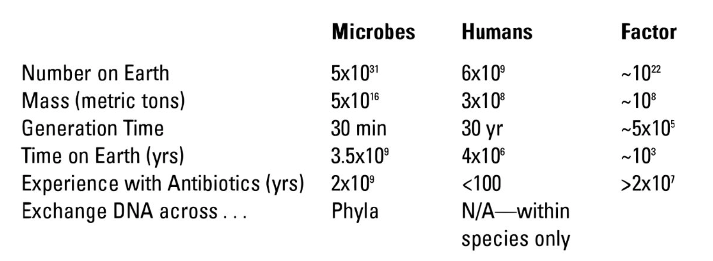{fig-align="center" width="80%"}

Microbes have been on Earth far longer than humans. They far outweigh us in biomass and reproduce much faster. Their experience with antibiotics far predates human therapeutic use. Antimicrobial resistance and the use of antibiotics existed long before we started using these drugs therapeutically [@spellberg.etal_2008c].

### Antimicrobial Use: Bacteria vs. Humans

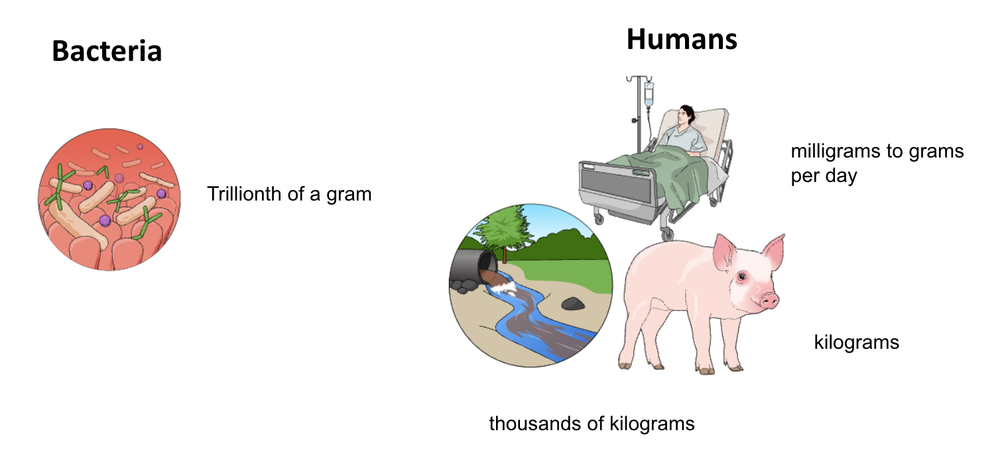{fig-align="center" width="600"}

**Bacteria** use antibiotics as part of a competitive strategy in the environment — secreting very small amounts, targeted to specific circumstances, over distances of a millionth of a meter or less, with minimal environmental exposure and selective pressure.

**Humans**, by contrast, use milligrams to grams per day. In animal food production and environmental waste, thousands of kilograms of antibiotics may enter the environment, creating considerable selective pressure for resistant organisms that previously did not exist.

### Chemical Warfare in Nature

Antibiotics have arisen through chemical warfare in nature. Among the most prolific natural sources are the **actinomycetes** — soil bacteria that produce a wide range of chemical substances interfering with biological processes in competing organisms. Fungi such as *Penicillium*, growing on rotting fruit, are another major source of antimicrobial compounds.

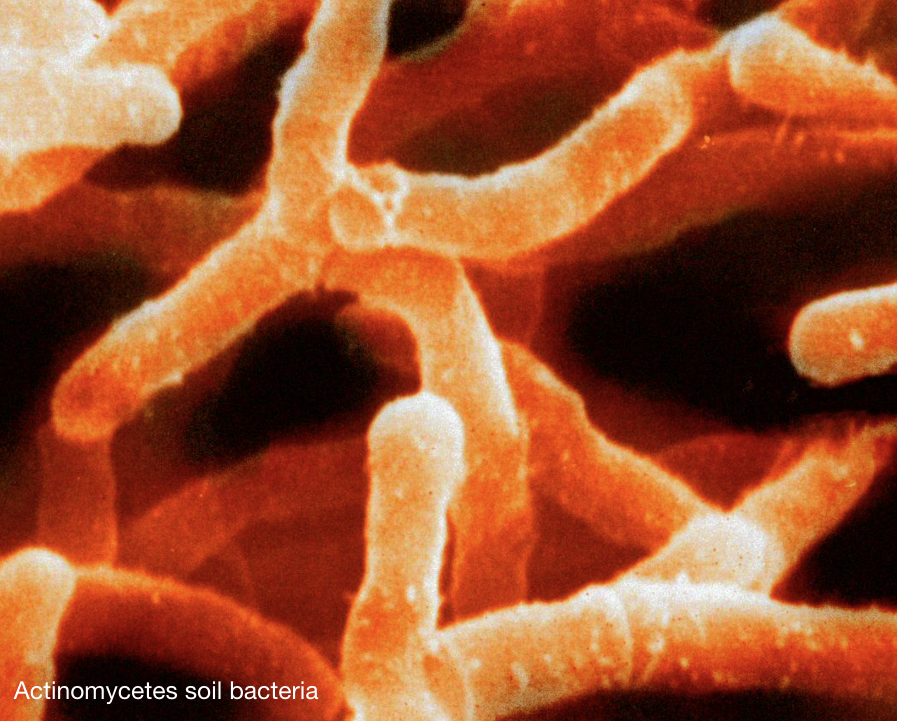{fig-align="center" width="50%"}

---

## Ancient Antibiotic Therapy

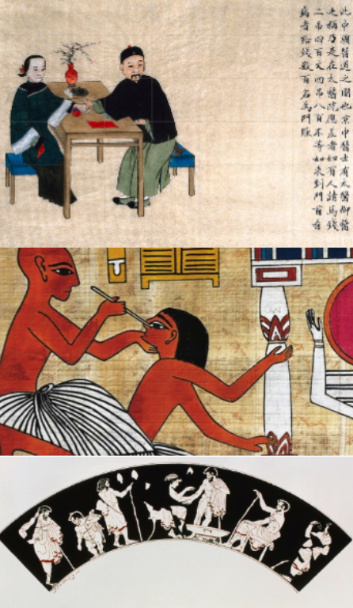{fig-align="center" width="300"}

Antibiotic therapy as a therapeutic approach has ancient roots:

- **China**: Moldy tofu was used to treat skin inflammation and infections
- **Egypt**: Moldy bread (*Aish baladi*) was used to treat skin lesions
- **Greece**: Myrrh, wine, honey or caustic substances were used to treat wound infections

### Egyptians Made Tetracycline Beer

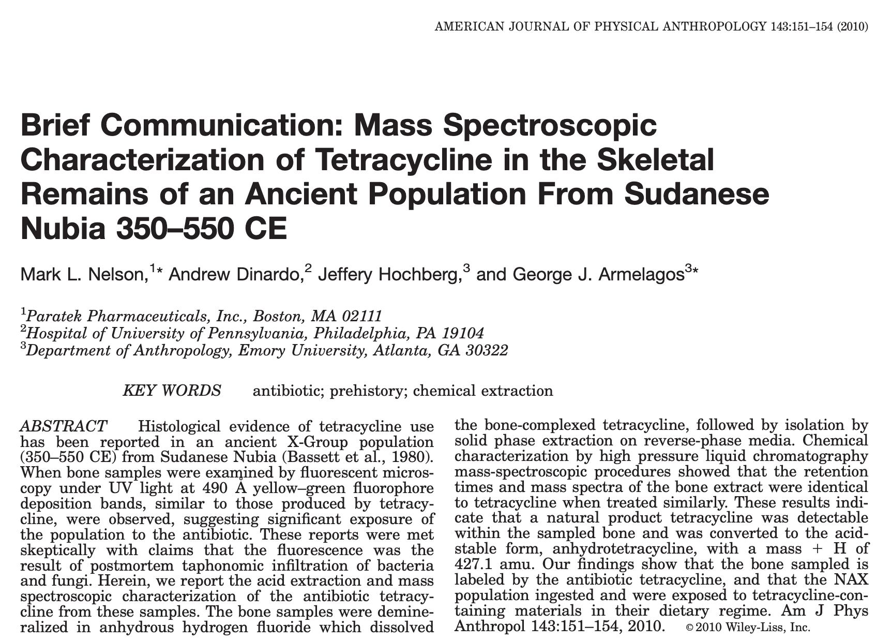{fig-align="center" width="600"}

Ancient Egyptians in the Sudanese Nubian area brewed beer contaminated with *Streptomyces* that produced tetracycline. Analysis of skeletal remains confirmed high tetracycline concentrations in bones from inhabitants dating to 350–550 CE [@nelson.etal_2010c].

---

## Paul Ehrlich (1854–1917): The Birth of Modern Antibiotics

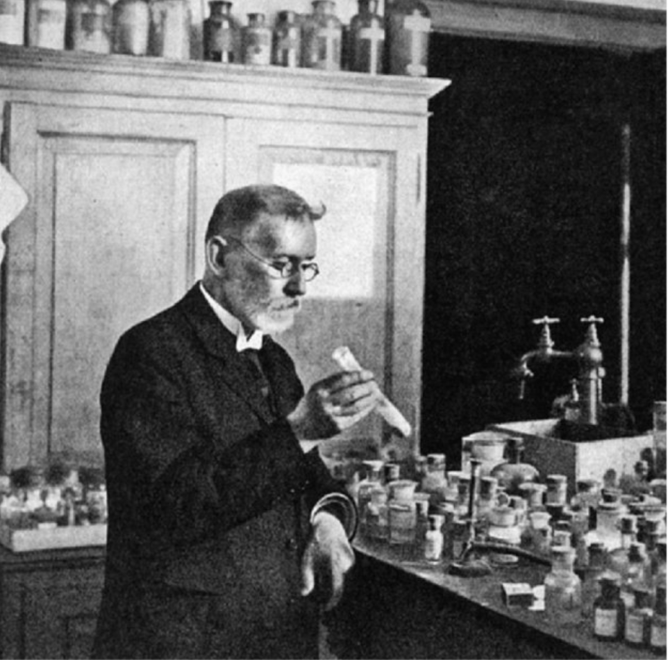{fig-align="center" width="50%"}

Paul Ehrlich developed methods for staining tissues with specific chemicals, enabling the distinction between different types of blood cells. This led him to the **"magic bullet" hypothesis**: if certain cells could be selectively stained, perhaps bacteria could also be selectively targeted and killed.

He undertook a vast screening program of chemical libraries — synthetic compounds — to identify active antimicrobial agents. After screening over 600 compounds, this rational approach led to the discovery of **arsphenamine (Salvarsan)** in 1909, the first effective treatment for syphilis caused by *Treponema pallidum*.

### Salvarsan: Promising but Toxic

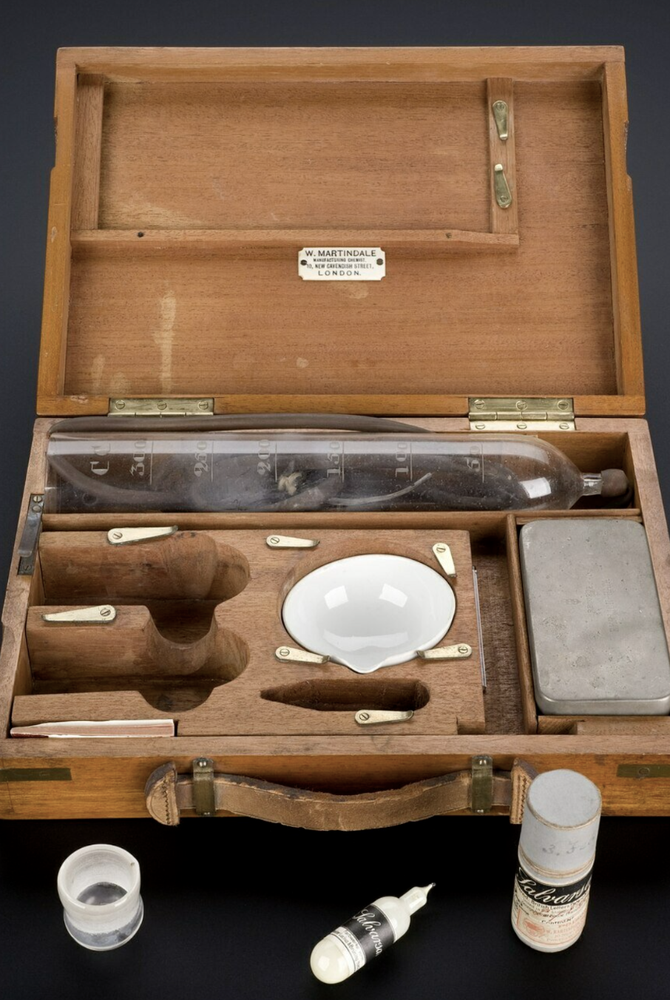{fig-align="center" width="50%"}

Salvarsan had to be reconstituted before administration, and its efficacy depended heavily on the skill of the physician. Side effects included rashes, liver damage, and risk of severe tissue injury with extravasation due to improper handling.

---

## Alexander Fleming (1881–1955): The Serendipitous Discovery

Fleming was a physician skilled at administering Salvarsan to syphilis patients. During World War I, he worked in a wound-research laboratory and discovered that chemical antiseptics failed to sterilize jagged wounds, while pus itself had its own antibacterial properties. In 1921, he discovered **lysozyme**, an enzyme in tears and secretions that causes bacteria to disintegrate, though its effectiveness against disease-causing bacteria was limited.

### Discovery of Penicillin

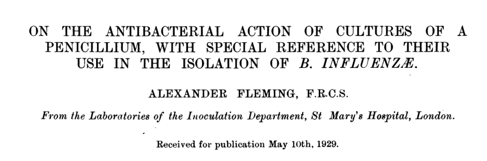{fig-align="center" width="45%"}

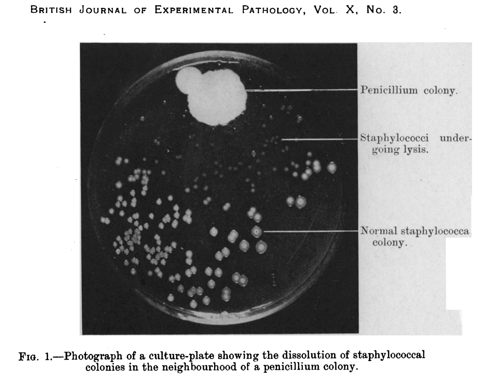{fig-align="center" width="45%"}

Fleming's serendipitous discovery came when a colony on an agar plate became contaminated with *Penicillium* mold. In the zone around the mold, staphylococci were undergoing lysis. He named the active substance **penicillin**, but could not purify enough to develop it as a therapeutic agent [@fleming_1929].

---

## Gerhard Domagk (1895–1964): Discovery of Sulfonamides

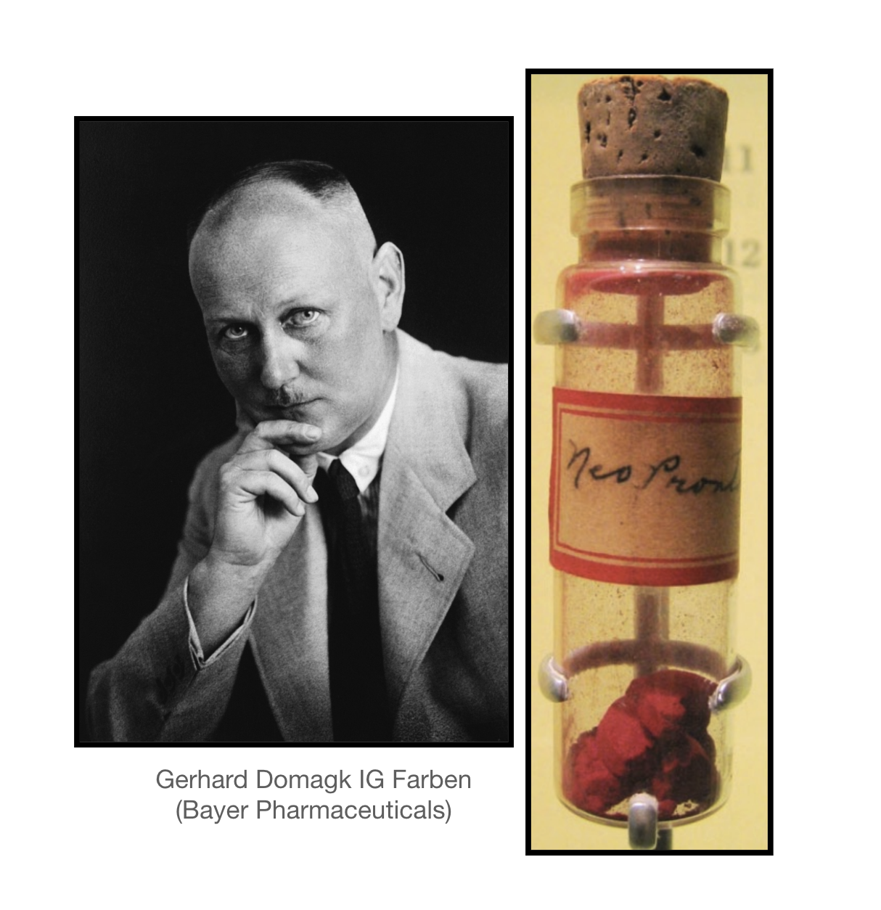{fig-align="center" width="40%"}

Following Ehrlich's approach of screening dye-industry chemicals, Domagk and colleagues at Bayer Pharmaceuticals discovered **Prontosil**, a compound metabolized *in vivo* to sulfanilamide. It was initially found inactive in test tube assays but effective in animal models — demonstrating the importance of *in vivo* metabolism.

Among the early patients was Domagk's own six-year-old daughter Hildegard, who had contracted a severe streptococcal cellulitis. When amputation was recommended, Domagk treated her with Prontosil. She recovered, but suffered permanent reddish skin discoloration from the drug.

---

## Florey, Chain, and Heatley: Purification of Penicillin

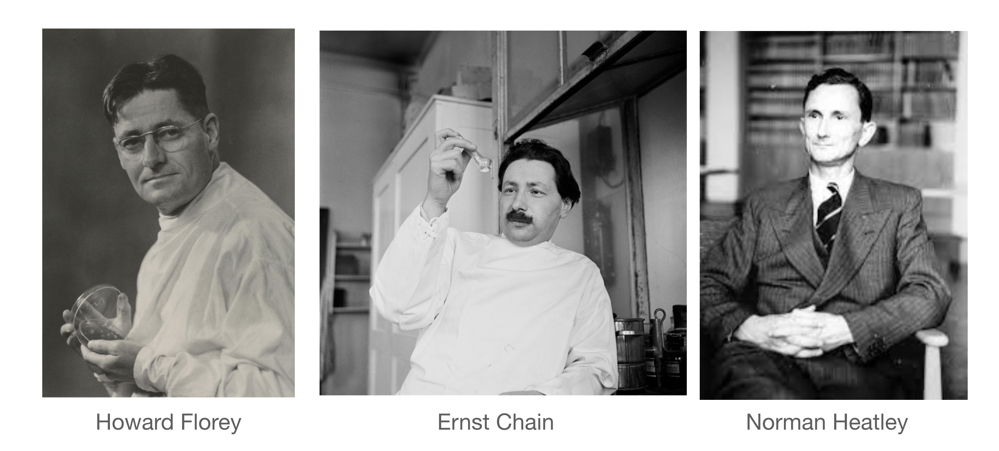{fig-align="center" width="80%"}

Unlike Fleming, the team at Oxford — biochemist **Ernst Chain** and **Norman Heatley** working under **Howard Florey** — was able to purify penicillin in sufficient quantities for animal studies and early clinical trials [@lobanovska.pilla_2017a].

### First Animal Testing

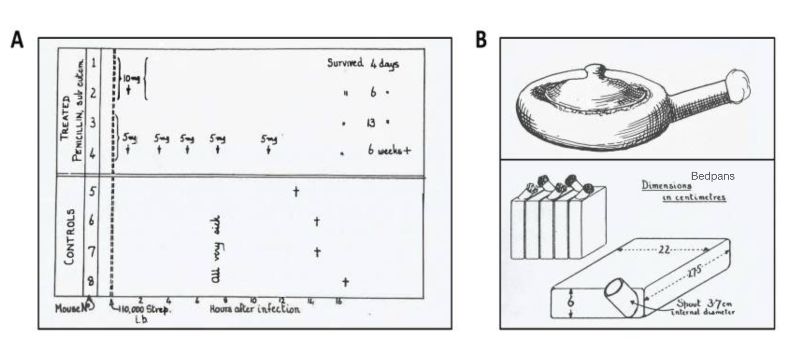{fig-align="center" width="80%"}

Animals treated with penicillin (5–10 mg) showed near-complete survival, while untreated controls died within 12–16 hours of infection.

### The Challenge of Production

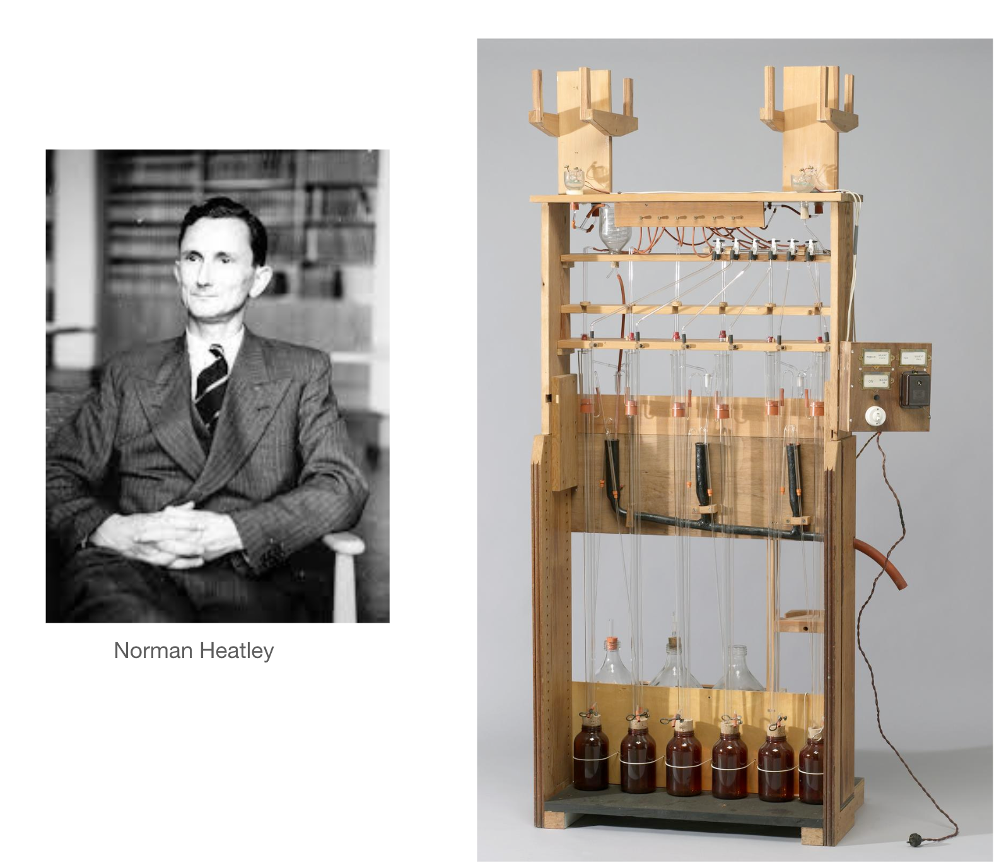{fig-align="center" width="50%"}

Producing enough penicillin was a major challenge during wartime. Heatley devised an inventive fermentation apparatus using incubation flasks similar to bedpans, enabling enough crude penicillin for early clinical studies.

### First Trials in Patients

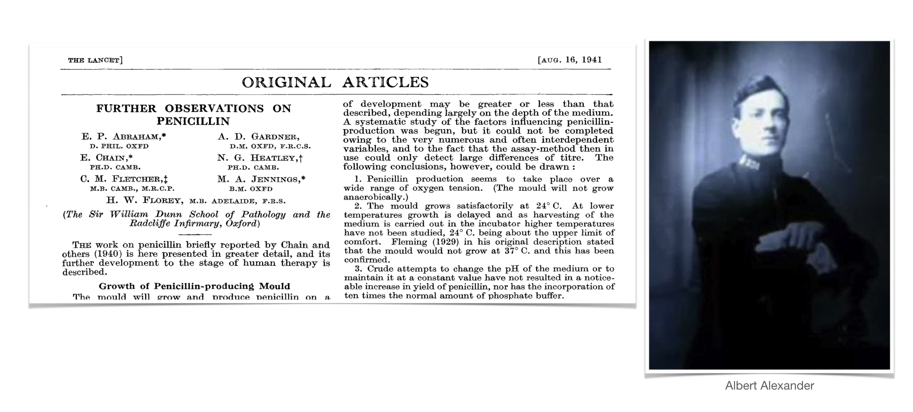{fig-align="center" width="80%"}

The first patient was a policeman with severe facial cellulitis caused by *Staphylococcus aureus* and *Streptococcus pyogenes*. After sulfa drugs failed, intravenous penicillin (200 mg, then 100 mg every 3 hours) produced a striking clinical improvement. Unfortunately, the penicillin supply was exhausted, the infection relapsed, and the patient died [@abraham.etal_1941].

### Clinical Response to Penicillin

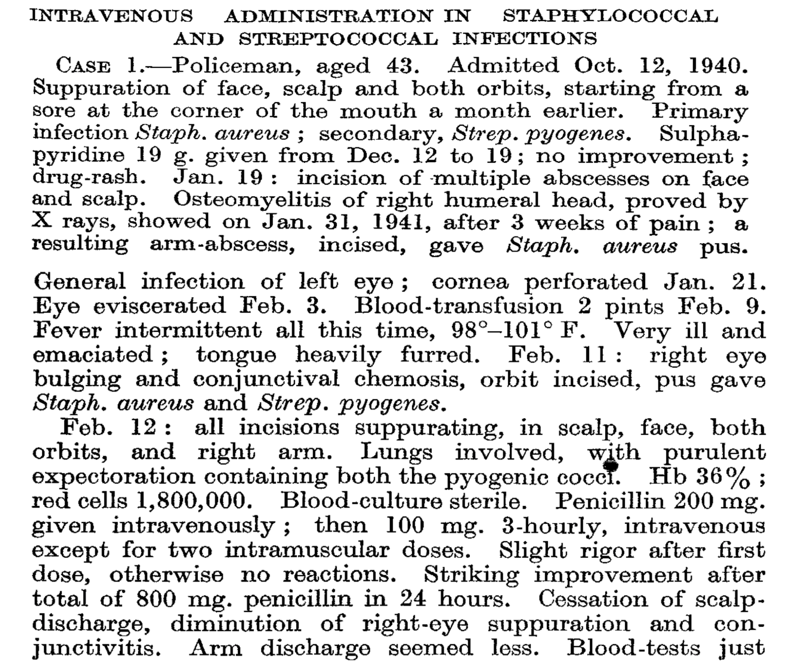{fig-align="center" width="600"}

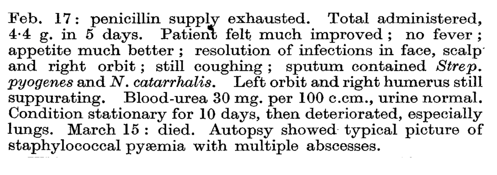{fig-align="center" width="80%"}

This experience demonstrated the power of antibiotics but also highlighted the urgent need for scaled production. Future trials focused on pediatric patients, where lower doses could be used.

---

## Churchill Saved by Sulfonamides (1943)

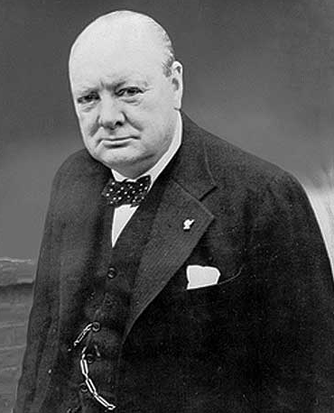{fig-align="center" width="60%"}

During World War II, Winston Churchill developed pneumonia and was treated effectively with sulfapyridine — a drug developed by the Germans.

---

## Industrial-Scale Penicillin Production

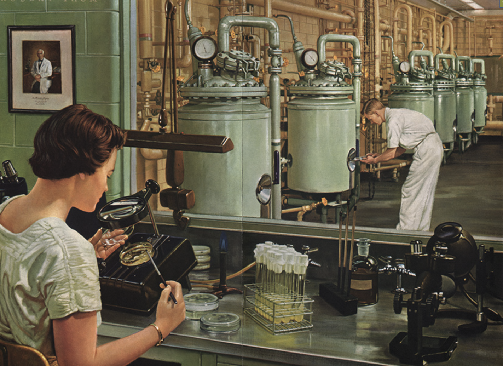{fig-align="center" width="45%"}

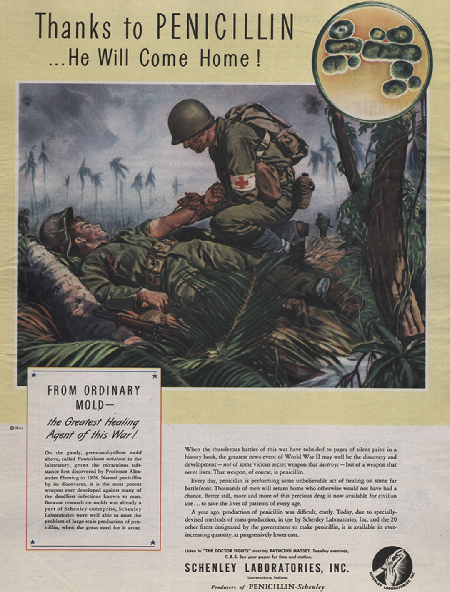{fig-align="center" width="45%"}

Florey and Heatley traveled to the United States and persuaded the pharmaceutical industry to mass-produce penicillin. This enabled clinical trials and wartime use, though the patent had to be shared among multiple companies. Oxford University received no royalties for the discovery.

---

## Structure of Penicillin

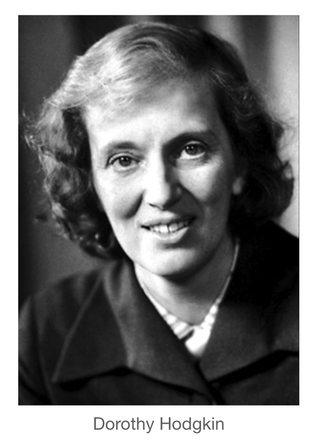{fig-align="center" width="40%"}

**Dorothy Hodgkin**, a crystallography expert at Oxford, determined the structure of penicillin in 1946 using X-ray crystallography — work that earned her the **Nobel Prize in Chemistry in 1964**. Knowledge of the structure enabled scientists to create semisynthetic penicillins with broader spectrum, increased stability, and reduced toxicity.

---

## First Reports of Penicillin Resistance

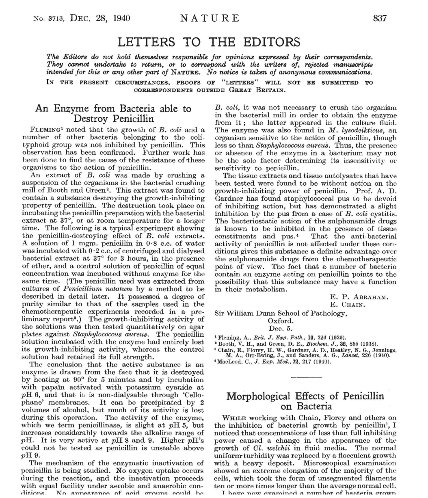{fig-align="center" width="600"}

Even before penicillin was widely used, Abraham and Chain reported that *Staphylococcus aureus* strains could produce an enzyme (penicillinase/β-lactamase) that destroyed penicillin [@abraham.chain_1940]. This foreshadowed a recurring pattern in antibiotic therapy.

### Repeating History: Resistance Follows Introduction

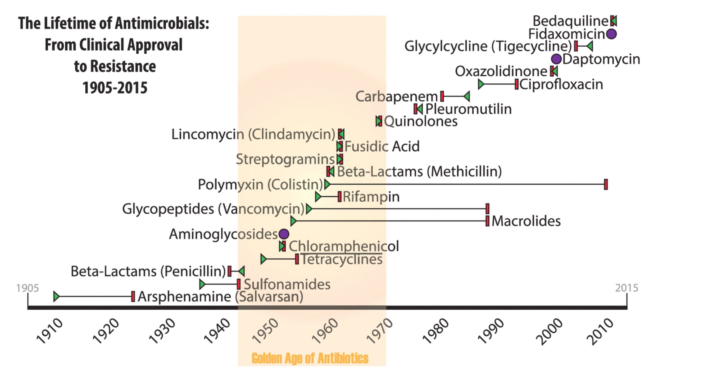{fig-align="center" width="80%"}

Throughout history, resistance has emerged after each new antibiotic class was introduced, often within just a few years [@spagnolo.etal_2021].

---

## Discovery of Cephalosporins

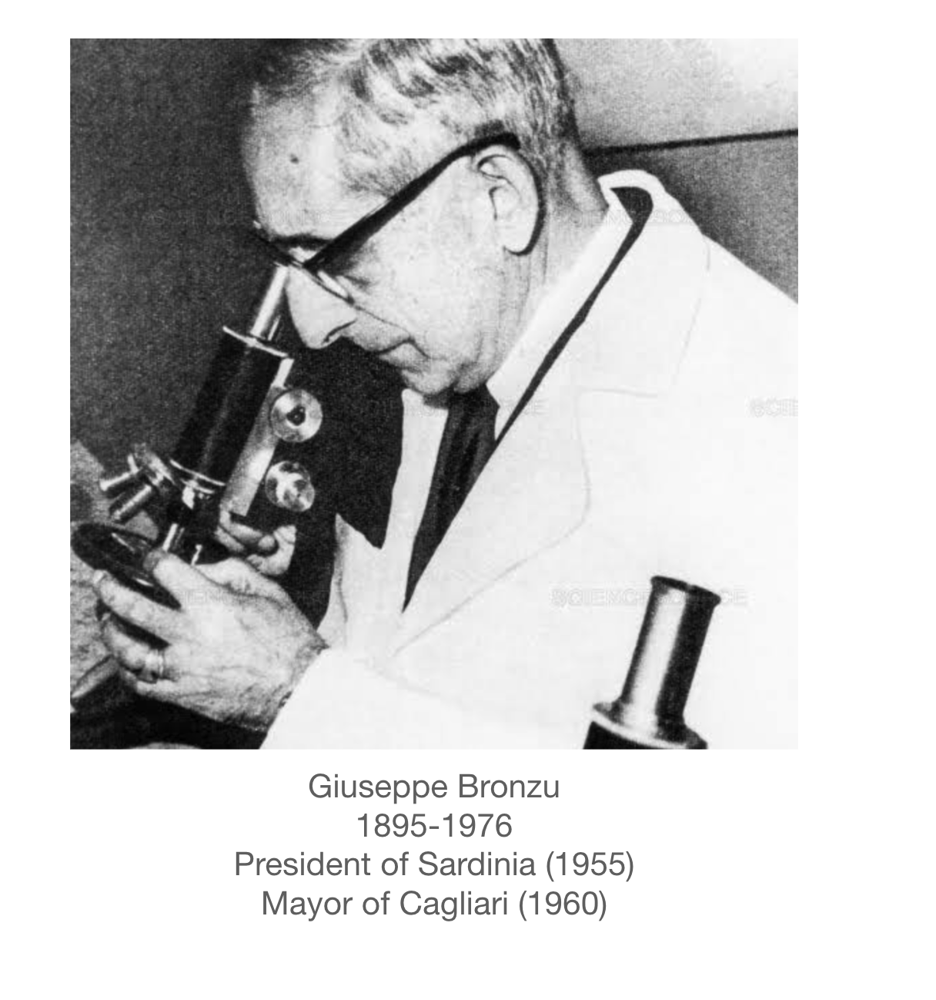{fig-align="center" width="40%"}

**Giuseppe Brotzu** was an epidemiologist studying typhoid in Cagliari, Sardinia. He noticed that *Salmonella typhi* was no longer culturable once sewage was discharged into the sea. He isolated the mold *Cephalosporium* (now *Acremonium*) from seawater in 1948 and found it produced substances (named "mycetin") active against *S. typhi* — which was resistant to penicillin due to β-lactamase production.

After failing to find Italian government support, Brotzu sent the fungus to Howard Florey at Oxford, leading to the isolation of **cephalosporin C** in 1962 and a whole new class of antibiotics.

---

## Selman Waksman and the Discovery of Streptomycin

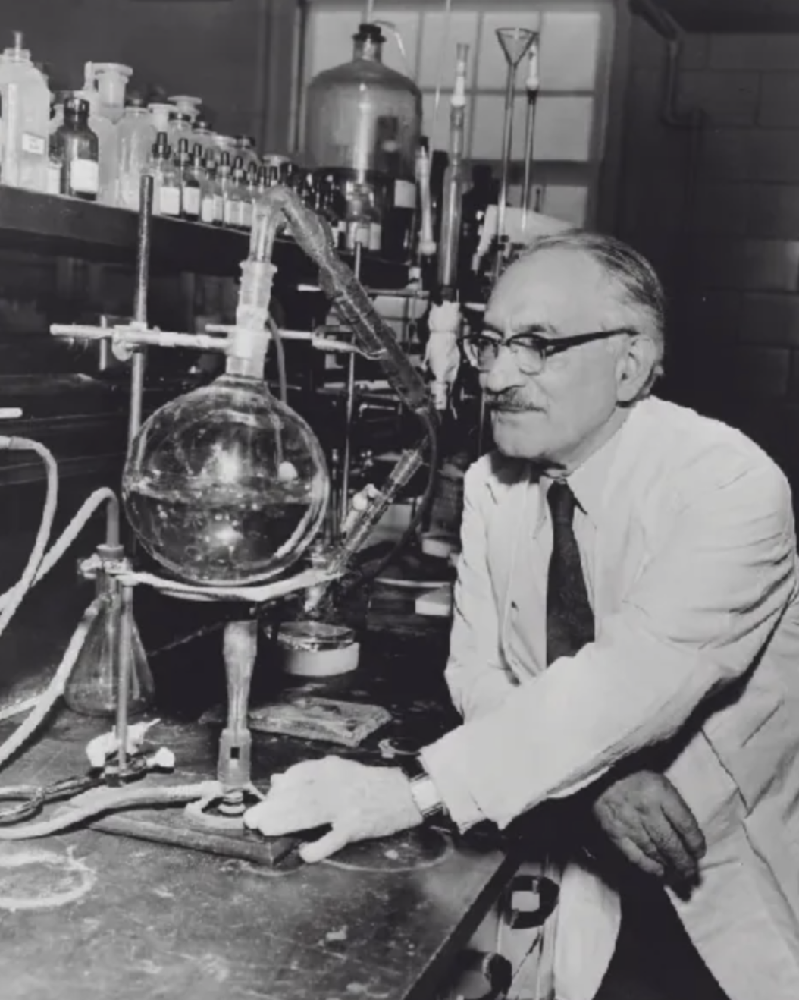{fig-align="center" width="50%"}

**Selman Waksman** and his team at Rutgers discovered multiple antimicrobials in the 1940s — including actinomycin, streptomycin, and neomycin — by screening soil bacteria from the genus *Streptomyces*. Waksman is also credited with coining the term **"antibiotic"**.

Streptomycin was the **first effective drug against tuberculosis**, which previously was treated only by sanatoriums. Notably, one of the first children treated with streptomycin in England was **Ringo Starr**, who learned to play the drums during music therapy while recovering in a sanatorium.

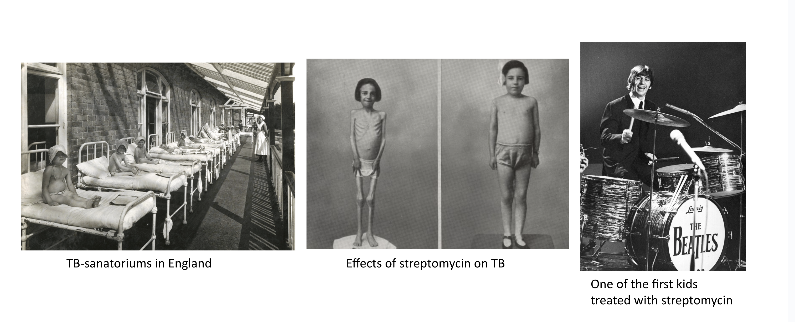{fig-align="center" width="70%"}

---

## The Golden Age of Antibiotics

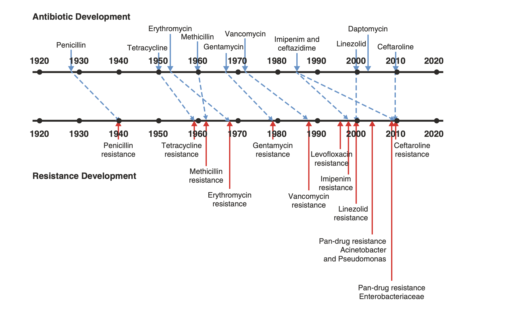{fig-align="center" width="90%"}

The 1940s through 1960s represented a golden age of antibiotic discovery, with systematic screening of soil organisms and natural products yielding compounds effective against many common pathogens [@milgroom_2023].

---

## The Crisis in New Antibiotic Development

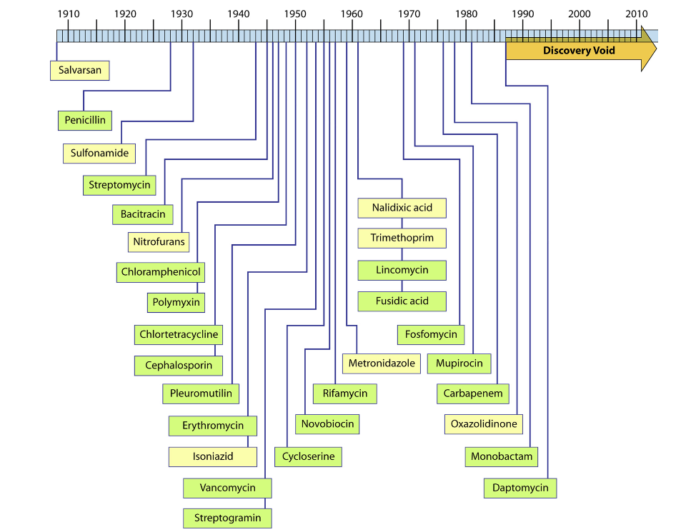{fig-align="center" width="600"}

Beginning in the late 1980s, new antibiotic discovery entered a prolonged void, with no truly novel antibiotic classes being discovered for decades [@silver2011].

### Why Has Antibiotic Discovery Faltered?

{fig-align="center" width="80%"}

Empirical screening of natural products was remarkably successful early on, but over time, the same antibiotics kept being rediscovered. This **dereplication problem** became increasingly expensive and time-consuming.

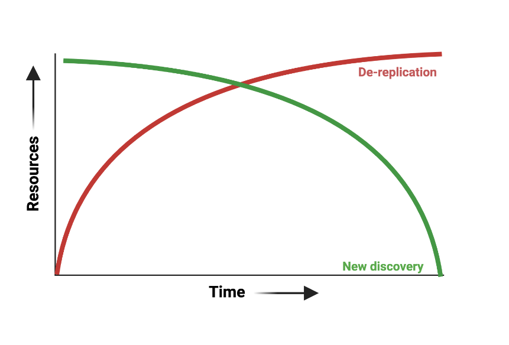{fig-align="center" width="80%"}

---

## The Shift from Empirical to Rational Discovery (1970s onward)

Two parallel strategies emerged:

**1. Modification of existing scaffolds** — Chemically altering known antibiotics to overcome resistance became a dominant strategy. This produced successive generations of cephalosporins, β-lactamase inhibitors, macrolides, tetracyclines, and fluoroquinolones.

### Cephalosporin Generations

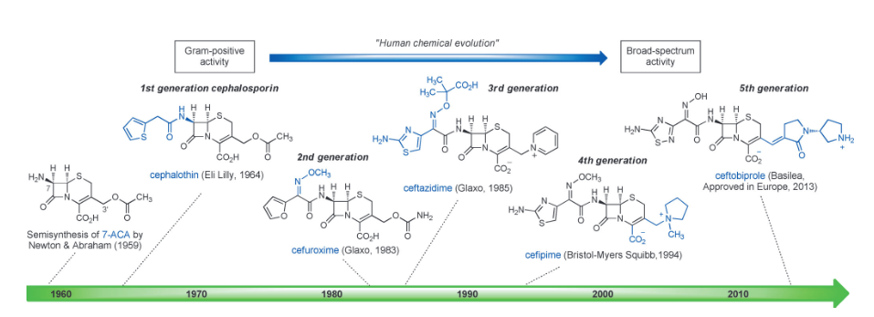{fig-align="center" width="80%"}

Modification of the cephalosporin scaffold produced first through fourth generation drugs, each with incremental improvements in spectrum, stability, and pharmacokinetics [@Wright2014].

### β-Lactamase Inhibitors

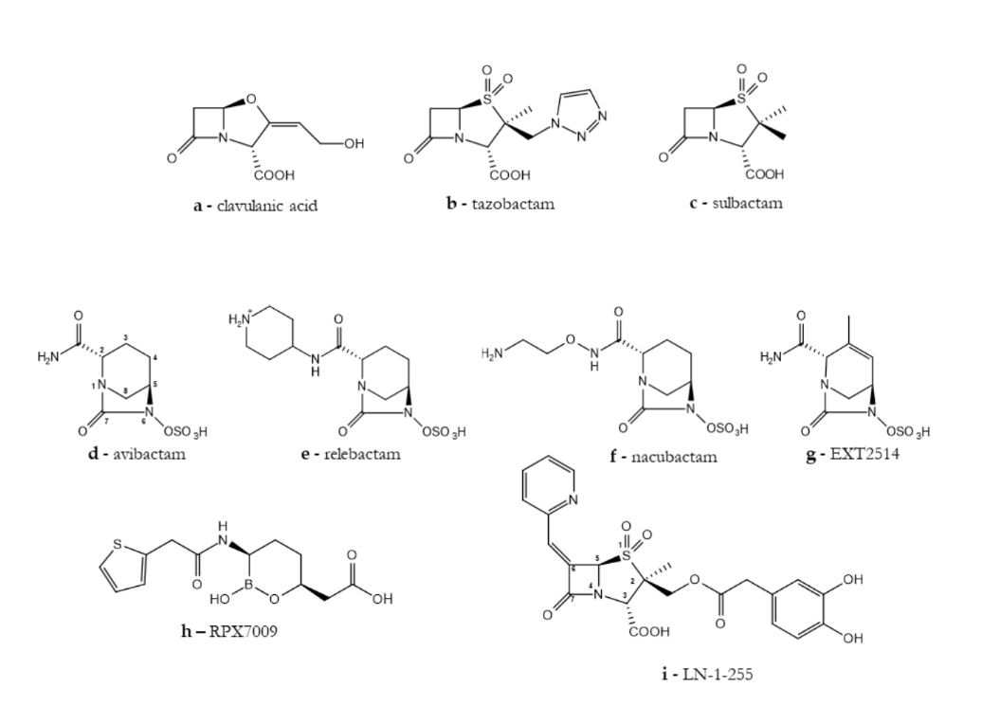{fig-align="center" width="80%"}

The development of clavulanic acid, tazobactam, sulbactam, and newer inhibitors targeting carbapenemases (avibactam, relebactam, vaborbactam) represents a strategy to reinvigorate existing drugs against resistant pathogens.

### Macrolides and Tetracyclines

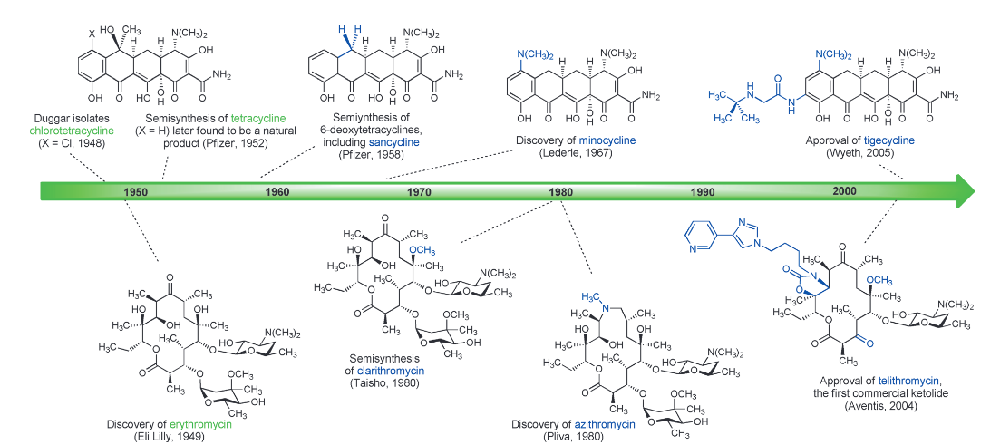{fig-align="center" width="80%"}

After erythromycin, modifications produced clarithromycin and azithromycin. Newer agents like tigecycline were designed to overcome major resistance mechanisms such as efflux and altered ribosomal binding [@Wright2014].

### Fluoroquinolones

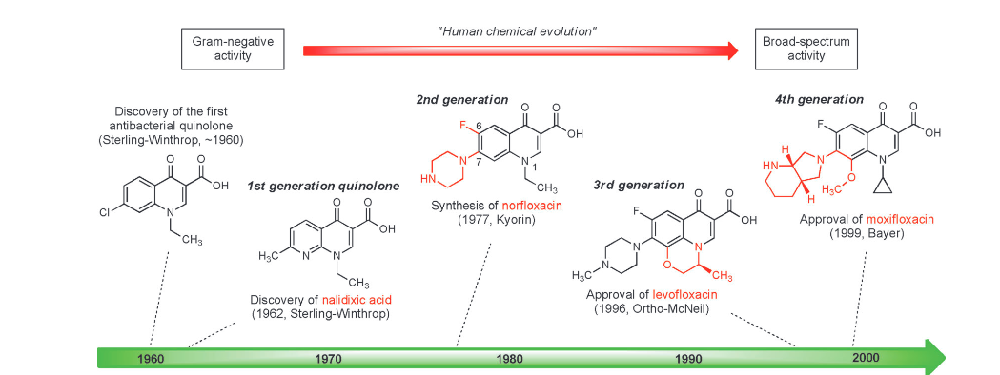{fig-align="center" width="80%"}

Fluoroquinolones underwent extensive modification, though some later-generation agents were removed from the market due to limited clinical benefit and toxicity concerns (QT prolongation, hepatotoxicity) [@Wright2014].

---

## Genomics and Targeted Screening (1990s–2000s)

**2. Rational, target-based discovery** — The sequencing of the *Haemophilus influenzae* genome in 1995 was expected to revolutionize antibiotic discovery by revealing novel bacterial targets not present in humans [@fleischmann1995].

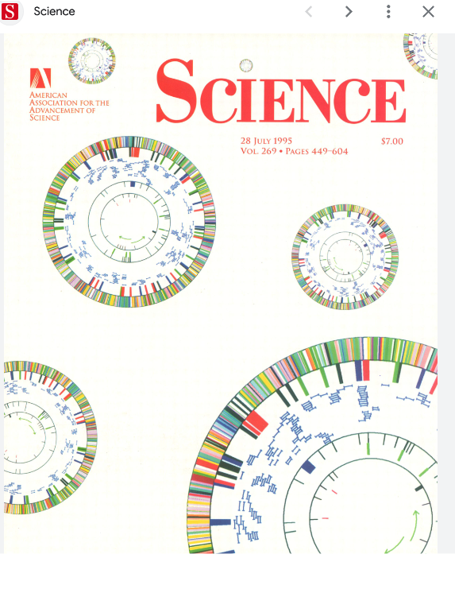{fig-align="center" width="35%"}

### Why Has Biotechnology Failed to Deliver?

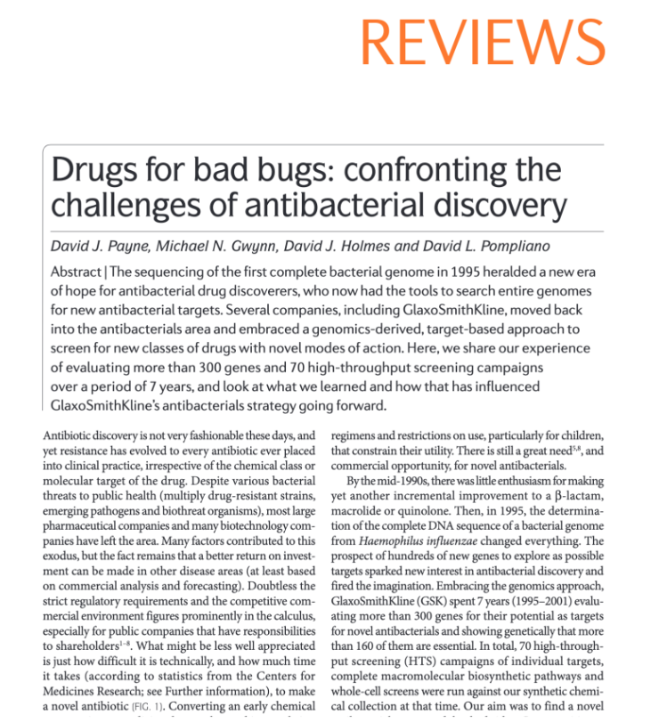{fig-align="center" width="500"}

A landmark paper from GlaxoSmithKline described their investment of millions of dollars evaluating over 300 gene targets and conducting 70 high-throughput screening campaigns over seven years — discovering no new antibiotics [@payne2007].

**Key problems with targeted screening:**

- Bias toward single-target inhibitors with high risk of rapid resistance development
- Bias toward eukaryotic (human) targets leading to off-target toxicity
- Chemical screening libraries dominated by lipophilic compounds lacking structural diversity needed for antibiotics
- Whole-cell screens identified detergent-like compounds; cell-free screens found target inhibitors with no whole-cell activity
- Screens rarely identified compounds with Gram-negative activity
- The fundamental problem: compound libraries did not reflect the unique physicochemical properties of known antibacterial agents

### It Is Difficult to Improve on Nature

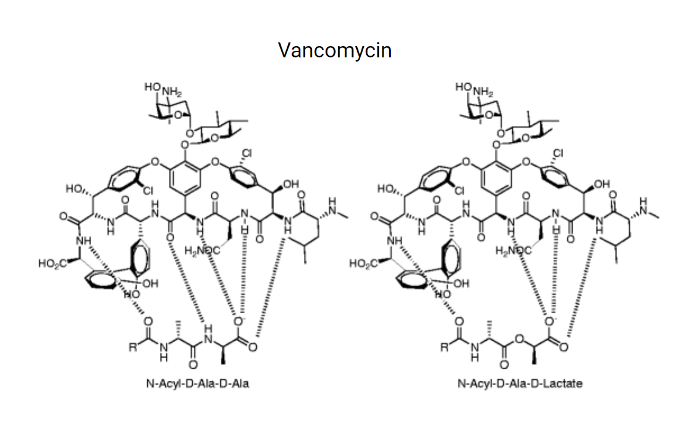{fig-align="center" width="70%"}

Natural antibiotics like vancomycin feature densely deployed functional groups optimized over billions of years of evolution for exquisite selectivity against pathogen targets.

### Searching the Wrong Physicochemical Space

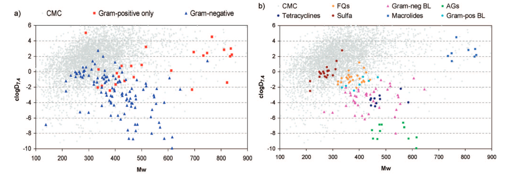{fig-align="center" width="80%"}

Known antibacterial agents occupy a distinct physicochemical space compared to typical pharmaceutical screening libraries [@OShea2008].

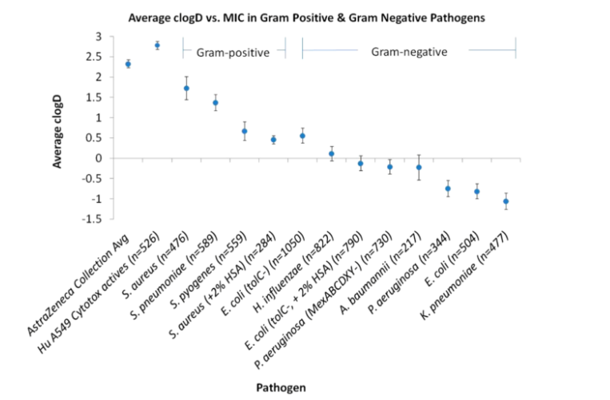{fig-align="center" width="80%"}

The physicochemical properties required vary considerably between pathogens. Gram-negatives typically require more hydrophilic compounds, and even the optimal hydrophilicity differs between species like *Klebsiella pneumoniae* and *Pseudomonas aeruginosa* [@brown2014].

### The Gram-Negative Challenge

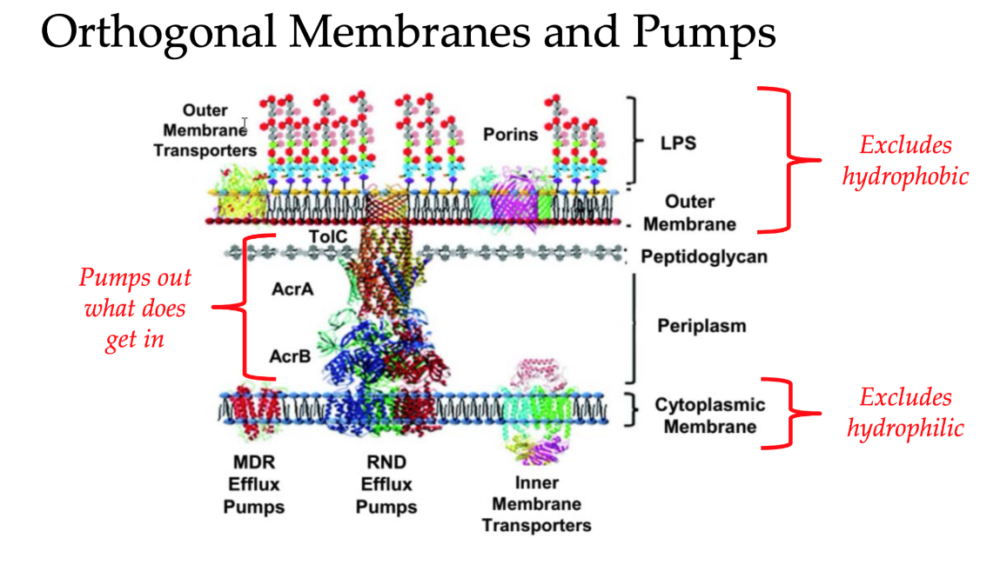{fig-align="center" width="80%"}

Gram-negative bacteria possess a complex outer membrane that excludes hydrophobic compounds. Drugs must enter through porins, avoid efflux pumps, and traverse the periplasm — making drug design exceptionally challenging. This is also why few orally bioavailable anti-Gram-negative drugs exist (fluoroquinolones being a notable exception).

---

## Moving Forward: Dual Strategies

### Targeted Screening — Renewed Promise

- Specific inhibitors and new β-lactamase inhibitors remain a rational and promising approach
- Massive advances in synthetic biology (combinatorial biosynthesis, pathway engineering)
- Development of new "antibiotic-like" chemical scaffolds for screening
- 30 years of lessons learned: better understanding of cell penetration, transport, efflux, and the need for more "druggable" chemical libraries

### Natural Product Screening — Revisiting the Source

- Billions of years of natural selection have optimized structures for antimicrobial activity
- **Less than 1% of prokaryotic and 7% of fungal strains have been isolated and cultured** — a vast untapped reservoir
- Natural products often inhibit multiple targets simultaneously due to their structural density
- More efficient methods for isolation and dereplication now exist

### Alternative Strategies

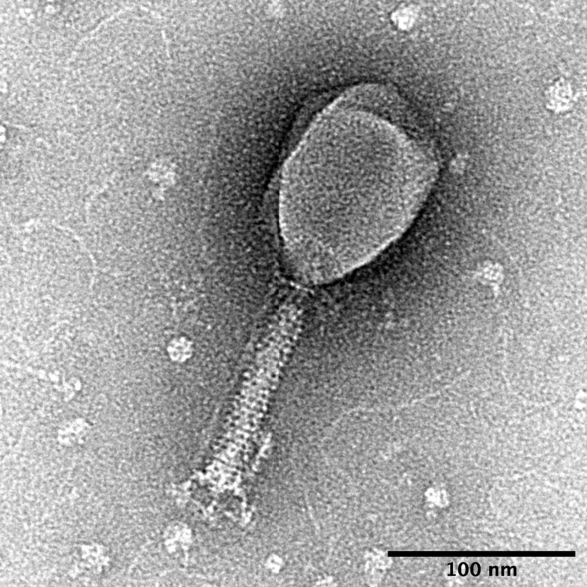{fig-align="center" width="50%"}

Emerging alternatives include:

- Antimicrobial peptides (AMPs)
- Monoclonal antibodies (MAbs)
- Antibody-antibiotic conjugates
- Bacteriophages
- Antisense-based antimicrobials (ASOs)
- Vaccination and immunotherapy

---

## The Remaining Problem: Economics

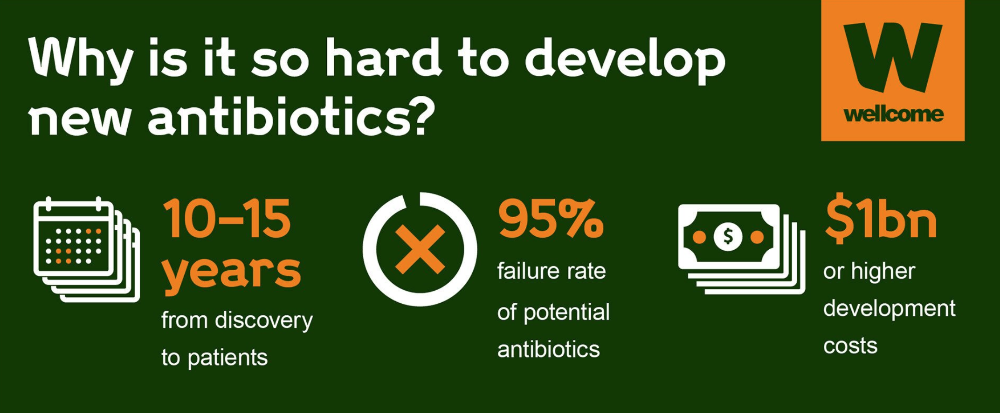{fig-align="center" width="80%"}

Developing an antibiotic takes 10–15 years from discovery to patients, with a failure rate exceeding 95% and costs over $1 billion. Many pharmaceutical companies have exited antibiotic development because even successful drugs are often shelved to preserve efficacy — destroying return on investment.

### Pull Incentives: The "Netflix" Model

{fig-align="center" width="70%"}

A proposed solution is to **delink antibiotic payments from sales volume** — paying companies for developing antibiotics regardless of use, similar to a Netflix subscription. This ensures availability when needed.

### Subscription Models: Italy Leads the Way

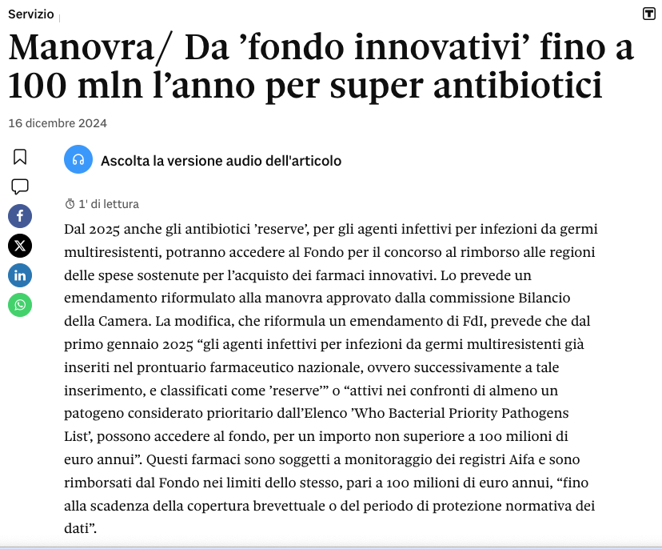{fig-align="center" width="80%"}

The Italian government has approved some of the first subscription-based models, ensuring continued access to newer antibiotics while providing financial sustainability for manufacturers.

---

## Summary

The parallel problems of increasing antibiotic resistance and declining novel antibiotic development represent a growing health crisis. Two schools of antibiotic discovery — **empirical** and **rational** — each have their proponents, advantages, and limitations. Despite transformative biotechnological advances, these have largely failed to deliver new antibiotics, especially for Gram-negative pathogens. Fixing the economics of antibiotic discovery and development, through models like subscription-based payments, will be essential to ensure antibiotics remain available for future generations.

---

## References

::: {#refs}
:::
